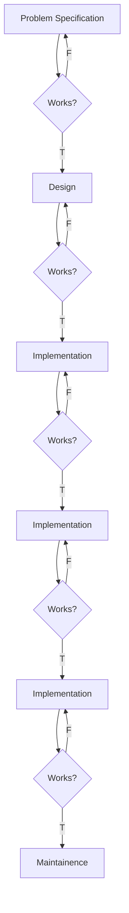

# Software Engineering
## Introduction
You must try to develop your software and hardware in a steady way s.t. your project amd program can be less error prone. We usually try to divide a certain project into several phases to give ourself a clear view about what to do and what should not be done during a certain phase. One can only move from a certain phase to another only if they reach the requirements of different phases. The cost of crossing through the layer casually will lead to catastrophic results and lead to a waste of time and more overWork. So!  
>NEVER TRY TO SIMPLY CODE AND TEST YOUR OWN CODE! AND WRITE TERRIBLE DOCUMENTATION! OR SIMPLY DOES NOT WRITE ANY DOCUMENTATION!!OMG. IT CAUSES FURTHER PROBLEM TO OTHER USERS AND TEAM MEMBERS! ALSO IT GET EXTREMELY HARD TO DEBUG YOUR SPAGHETTI CODE.

## MODELS
### WaterFall models

